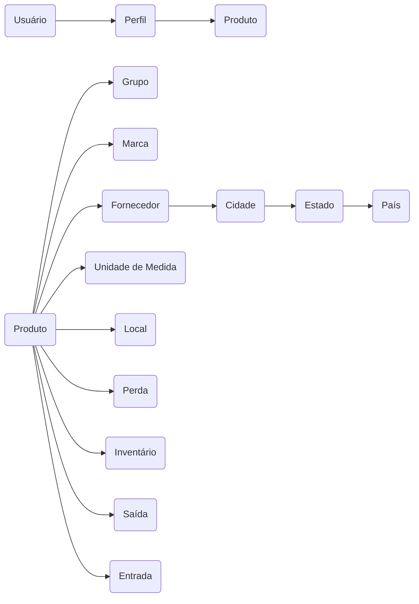

### <!-- Sistema de Gestão de Materiais Ferroviários -  --> SISMF

### Conceitos Básicos
Controle de fluxo de entrada e saída de produtos em uma empresa.
- Conjunto de produtos armazenados em um local.
- Dinheiro armazenado na empresa;
- 
**Pra que serve?**
- Bater as contas no final do mês;
- Calcular Lucros;
- Identificar perdas;
- Contribuir para o governo(ICMS);
---
Tipos de Estoque:
- **Matéria-prima** (celulose, minério de ferro, petróleo, etc).
- **Produtos não acabados** (peças, motores, chips, componentes eletrônicos, etc).
- **Produtos finalizados**  (carros, notebooks, etc).
- **Consumíveis** - (combustíveis, materiais de escritório, etc).

Grupos de Funcionalidades:
1) **Infraestrutura:**
	Tratamento de Exceção;
	Gravação de Logs em arquivos;	
	Autenticação;
	Autorização;
	Auditoria;

2) **Cadastros:**
	Grupos (tipos) de produtos;
	Marcas de produtos;
	Locais de Armazenamento;
	Unidades de Medida;
	Países, Estados, Cidades;
	Fornecedores;
	Produtos;
	Perfis de Usuários;
	Usuários

3) **Operações:**
	Entrada de Produtos;
	Saída de Produtos;
	Lançamentos de Perdas de Produtos;
	Inventário de Estoque;

4) **Relatórios:**
	Posição de estoque;
	Ressuprimento;

5) **Gráficos:**
	Perdas por mês;
	Entradas vs Saídas por mês;

### Apresentação da Aplicação

### Fluxo de Execução Típico

StackEdit stores your files in your browser, which means all your files are automatically saved locally and are accessible **offline!**

### Funcionalidades da App

StackEdit stores your files in your browser, which means all your files are automatically saved locally and are accessible **offline!**

### Modelo de Dados

The file explorer is accessible using the button in left corner of the navigation bar. You can create a new file by clicking the **New file** button in the file explorer. You can also create folders by clicking the **New folder** button.

### Tecnologias Utilizadas

Microsoft SQL Server, .NET Core, Linguagem C#, Javascript.

### HANDS-ON

### Estrutura Básica da App

You can rename the current file by clicking the file name in the navigation bar or by clicking the **Rename** button in the file explorer.

### Controle de Usuários

You can delete the current file by clicking the **Remove** button in the file explorer. The file will be moved into the **Trash** folder and automatically deleted after 7 days of inactivity.

### Cadastros

You can export the current file by clicking **Export to disk** in the menu. You can choose to export the file as plain Markdown, as HTML using a Handlebars template or as a PDF.

There are two types of synchronization and they can complement each other:

- The workspace synchronization will sync all your files, folders and settings automatically. This will allow you to fetch your workspace on any other device.
	> To start syncing your workspace, just sign in with Google in the menu.

- The file synchronization will keep one file of the workspace synced with one or multiple files in **Google Drive**, **Dropbox** or **GitHub**.
	> Before starting to sync files, you must link an account in the **Synchronize** sub-menu.

### Relatórios

You can open a file from **Google Drive**, **Dropbox** or **GitHub** by opening the **Synchronize** sub-menu and clicking **Open from**. Once opened in the workspace, any modification in the file will be automatically synced.

### Gráficos

You can save any file of the workspace to **Google Drive**, **Dropbox** or **GitHub** by opening the **Synchronize** sub-menu and clicking **Save on**. Even if a file in the workspace is already synced, you can save it to another location. StackEdit can sync one file with multiple locations and accounts.

### Aplicativo Móvel

Once your file is linked to a synchronized location, StackEdit will periodically synchronize it by downloading/uploading any modification. A merge will be performed if necessary and conflicts will be resolved.

If you just have modified your file and you want to force syncing, click the **Synchronize now** button in the navigation bar.

> **Note:** The **Synchronize now** button is disabled if you have no file to synchronize.

# Markdown extensions

StackEdit extends the standard Markdown syntax by adding extra **Markdown extensions**, providing you with some nice features.

> **ProTip:** You can disable any **Markdown extension** in the **File properties** dialog.

### SmartyPants

SmartyPants converts ASCII punctuation characters into "smart" typographic punctuation HTML entities. For example:

|                |ASCII                          |HTML                         |
|----------------|-------------------------------|-----------------------------|
|Single backticks|`'Isn't this fun?'`            |'Isn't this fun?'            |
|Quotes          |`"Isn't this fun?"`            |"Isn't this fun?"            |
|Dashes          |`-- is en-dash, --- is em-dash`|-- is en-dash, --- is em-dash|

### Final Drafts:
Tudo começa na compra, todo produto é comprado por um fornecedor.
E aí há uma entrada, uma saída e a venda pelo PDV.

Em algum momento as perdas precisam ser registradas.
Inventário também tem que ser feito de tempos em tempos.

Cuidados:

1. Nunca pode faltar produto (relatórios fazem a diferença);
2. Nunca pode sobrar produtos em exagero;
3. Fazer inventários periodicamente;
4. Controlar a quantidade mínima (para não deixar faltar);

Tools:
#mermaid
#stackedit