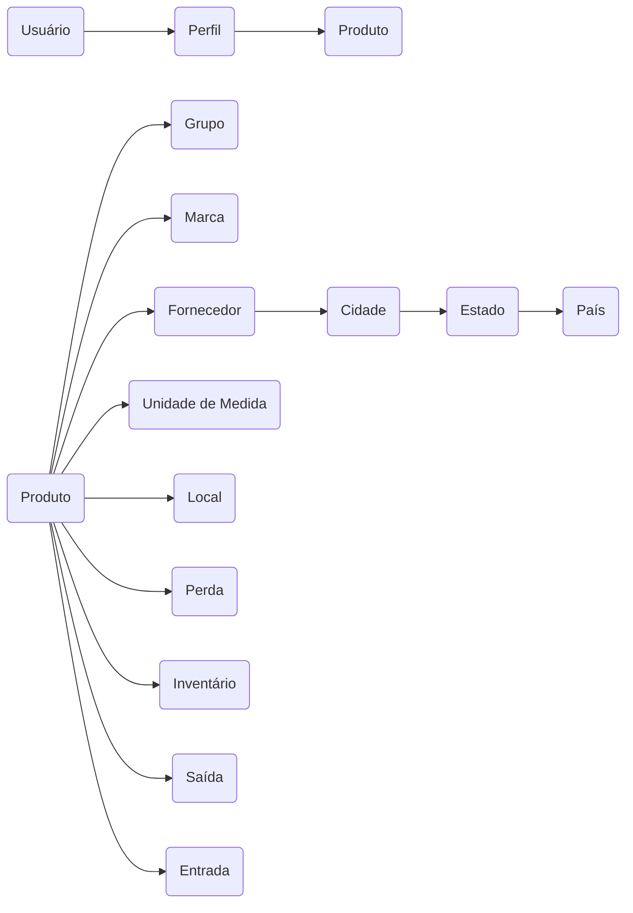

Sistemas de Informação | Instituto Federal do Maranhão @IFMA <br/>
Pré-projeto para a disciplina de Análise e Projeto de Sistemas. <br/>
Melhorando também habilidades para suporte para Sistemas Legados.

### <!-- Sistema de Gerenciamento de Materiais Ferroviários -  --> SISMF

**GRUPOS DE FUNCIONALIDADES:**

1) **Infraestrutura:**
- Tratamento de Exceção;
- Gravação de Logs em arquivos;	
- Autenticação;
- Autorização;
- Auditoria;

2) **Cadastros:**
- Grupos (tipos) de produtos;
- Marcas de produtos;
- Locais de Armazenamento;
- Unidades de Medida;
- Países, Estados, Cidades;
- Fornecedores;
- Produtos;
- Perfis de Usuários;
- Usuários

3) **Operações:**
- Entrada de Produtos;
- Saída de Produtos;
- Lançamentos de Perdas de Produtos;
- Inventário de Estoque;

4) **Relatórios:**
- Posição de estoque;
- Ressuprimento;

5) **Gráficos:**
- Perdas por mês;
- Entradas vs Saídas por mês;

<!-- ### Apresentação da Aplicação -->


### FLUXO DE EXECUÇÃO BÁSICO:

Usuário está ligado a todas as entidades, que acabam por se tornar tabelas do banco de dados e referência semântica para o padrão de projeto MVC:



### FUNCIONALIDADES DA APP:

**Menu do Sistema:**

Com as entidades definidas já é possível criar as guias de menu com as listas suspensas (Dropdowns) de funcionalidades, aplicando a abordagem Top Down para abstrair os respectivos Controllers e Métodos. Vide abaixo trecho de código das listas de menu em   `sismf_web\Views\Shared\_Layout.cshtml`:

```html
...
<div class="navbar-collapse collapse">
    @if (Request.IsAuthenticated)
    {
        <ul class="nav navbar-nav">
            <li>
                <a href="#" class="dropdown-toggle" data-toggle="dropdown">
                    Cadastros
                    <span class="caret"></span>
                </a>
                <ul class="dropdown-menu">
                    <li>@Html.ActionLink("Grupo de Produtos", "GrupoProduto", "Cadastro")</li>
                    <li>@Html.ActionLink("Marcas de Produtos", "MarcaProduto", "Cadastro")</li>
                    <li>@Html.ActionLink("Locais de Armazenamento", "LocalProduto", "Cadastro")</li>
                    <li>@Html.ActionLink("Unidades de Medida", "UnidadeMedida", "Cadastro")</li>
                    <li>@Html.ActionLink("Produtos", "Produto", "Cadastro")</li>
                    <li class="nav-divider"></li>
                    <li>@Html.ActionLink("Países", "Pais", "Cadastro")</li>
                    <li>@Html.ActionLink("Estados", "Estado", "Cadastro")</li>
                    <li>@Html.ActionLink("Cidades", "Cidade", "Cadastro")</li>
                    <li class="nav-divider"></li>
                    <li>@Html.ActionLink("Perfis de Usuários", "UsarioPerfil", "Cadastro")</li>
                    <li>@Html.ActionLink("Usuários", "Usuario", "Cadastro")</li>
                </ul>
            </li>

            <li>
                <a href="#" class="dropdown-toggle" data-toggle="dropdown">
                    Operações
                    <span class="caret"></span>
                </a>
                <ul class="dropdown-menu">
                    <li>@Html.ActionLink("Entrada de Produtos", "EntradaProduto", "Operacao")</li>
                    <li>@Html.ActionLink("Saída de Produtos", "SaidaProduto", "Operacao")</li>
                    <li>@Html.ActionLink("Perdas de Produto", "LancPerdaProduto", "Operacao")</li>
                    <li>@Html.ActionLink("Inventário de Estoque", "InvetarioEstoque", "Operacao")</li>
                </ul>
            </li>

            <li>
                <a href="#" class="dropdown-toggle" data-toggle="dropdown">
                    Relatórios
                    <span class="caret"></span>
                </a>
                <ul class="dropdown-menu">
                    <li> @Html.ActionLink("Posição do Estoque", "PosicaoEstoque", "Relatorio")</li>
                    <li> @Html.ActionLink("Ressuprimento", "Ressuprimento", "Relatorio")</li>
                </ul>
            </li>

            <li>
                <a href="#" class="dropdown-toggle" data-toggle="dropdown">
                    Gráficos
                    <span class="caret"></span>
                </a>
                <ul class="dropdown-menu">
                    <li>@Html.ActionLink("Perdas por mês", "PerdaMes", "Grafico")</li>
                    <li>@Html.ActionLink("Entradas vs Saídas por mês", "EntradaSaidaMes", "Grafico")</li>
                </ul>
            </li>
        </ul>

        using (Html.BeginForm("LogOff", "Conta", FormMethod.Post, new { id = "logoffForm" }))
        {
            <ul class="nav navbar-nav navbar-right">
                <li>@Html.ActionLink("Sobre o SISMF", "About", "Home")</li>
                <li>@Html.ActionLink("Desenvolvedor", "Contact", "Home")</li>
                <li><a href="javascript:document.getElementById('logoffForm').submit()">Sair</a></li>
            </ul>
        }
    }
    else
    {
        <ul class="nav navbar-nav navbar-right">
            <li>@Html.ActionLink("Login", "Login", "Conta")</li>
        </ul>
    }
</div>
...
```

**Autenticação**:

*Diagrama de Autenticação - To do*

A `view Login` é criada para coletar o input de credenciais do usuário. Sendo assim, a `controller Conta` chama a `Action Login`, passa como parâmetro a URL, o método HTTP e mais algumas estilizações da View. Teremos então:
- Campos de `login` e `senha`;
- Checkbox `Lembrar-me!`;
- Button para submit;

```cs
...
<section id="loginform">
    @using (Html.BeginForm("Login", "Conta", new { ReturnUrl = ViewBag.ReturnUrl }, 
        FormMethod.Post, new { @class = "form-horizontal", role = "form" }))
    {
        @Html.ValidationSummary(true, "", new { @class = "text-danger" })
        <div class="form-group">
            @Html.LabelFor(m => m.Usuario, new { @class = "control-label col-md-2" })
            <div class="col-md-10">
                @Html.TextBoxFor(m => m.Usuario, new { @class = "form-control" })
                @Html.ValidationMessageFor(m => m.Usuario, "", new { @class = "text-danger"})
            </div>
        </div>

        <div class="form-group" >
            @Html.LabelFor(m => m.Senha, new { @class = "control-label col-md-2" })
            <div class="col-md-10">
                @Html.TextBoxFor(m => m.Senha, new { @class = "form-control" })
                @Html.ValidationMessageFor(m => m.Senha, "", new { @class = "text-danger" })
            </div>
        </div>

        <div class="form-group">
            <div class="col-md-10 col-md-offset-2">
                @Html.CheckBoxFor(m => m.LembrarMe)
                @Html.LabelFor(m => m.LembrarMe)
            </div>
        </div>

        <div class="form-group">
            <div class="col-md-10 col-md-offset-2">
                <input type="submit" class="btn btn-sucess" value="Entrar" />
            </div>
        </div>
    }
</section>
...
```

Em seguida configura-se o ASP NET para trabalhar com forms indo até o `web.config`, incluindo nele as seções `Authorization` e `Authentication`.

```cs

<configuration>
...
  <system.web>
      <authentication mode="Forms">
          <forms loginUrl="~/Conta/Login" name=".sismf_web"></forms>
      </authentication>
      <authorization >
          <deny users="?"/>
      </authorization>
    <compilation debug="true" targetFramework="4.5.2" />
    <httpRuntime targetFramework="4.5.2" />
    ...
  </system.web>

```

Em seguida, fazemos a ligação através da respectiva ViewModel, e após criarmos a classe, incluimos os nossos atributos.
Um recurso muito bacana para melhorar os labels no front, é usar o atributo `[Display(Name "Texto")]`.

```cs
...
namespace sismf_web.Models
{
    public class LoginViewModel
    {
        [Required(ErrorMessage = "Informe o Usuário:")]
        //Mensagem para cada campo exigindo dados.
        [Display(Name = "Usuário: ")]
        public string Usuario { get; set;  }

        [Required(ErrorMessage = "Informe a Senha:")]
        //Mensagem para cada campo exigindo dados.
        [DataType(DataType.Password)]
        [Display(Name = "Senha: ")]
        public string Senha { get; set; }

        [Display(Name = "Lembrar-me!")]
        public bool LembrarMe { get; set; }
    }
}
```

Após, fazemos um bind na `View Login`, e assim ela passa a ter correspondência com a `LoginViewModel`:

```cs
@model sismf_web.Models.LoginViewModel
@{ 
    ViewBag.Title = "Login";
}
...
```

Criamos `ContaController`, cujos métodos são `Login` e `Logoff`:

```js
...
namespace sismf_web.Controllers
{
    public class ContaController : Controller
    {
        [AllowAnonymous] //Tornando o Login Púbico
        public ActionResult Login(string returnUrl)
        {
            ViewBag.ReturnUrl = returnUrl;
            return View();
        }

        [HttpPost]
        [AllowAnonymous]
        public ActionResult Login(LoginViewModel login, string returnUrl)
        {
            if (!ModelState.IsValid)
            {
                return View(login);
            }

            //Simulação do banco de dados:
            var achou = (login.Usuario == "yullano90" && login.Senha == "teste");
            if (achou)
            {
                //Validação se a URL informada está dentro do domínio:
                FormsAuthentication.SetAuthCookie(login.Usuario, login.LembrarMe);
                if (Url.IsLocalUrl(returnUrl)) //Uma vez usuário validado fazer o redirect:
                {
                    return Redirect(returnUrl);
                }
                else
                {
                    RedirectToAction("Index", "Home"); //Do contrário retornar pra Home:
                }
            }
            else
            {
                ModelState.AddModelError("", "Login Inválido."); //Aviso para informações incorretas
            }
            return View(login);
        }

        [HttpPost]
        [AllowAnonymous]
        public ActionResult LogOff()
        {
            FormsAuthentication.SignOut();
            return RedirectToAction("Index", "Home");
        }
    }
}
...
```

**Autenticação via Banco de Dados**:
Criamos uma classe que validará o usuário e terá acesso a dados.
*Referência ao folder DAL - To Do*
zRHdJy3w-ZQ&list=PLBIZ3dmiYIYnMaxogi0YTT7n9aZAoM7TY&index=6


**Alteração de Senha**:
y2bM2leOcL8&list=PLBIZ3dmiYIYnMaxogi0YTT7n9aZAoM7TY&index=35


**Redefinição de Senha**:
KJ2SOxbbUbg&list=PLBIZ3dmiYIYnMaxogi0YTT7n9aZAoM7TY&index=36
 

### MODELO DE DADOS


### TECNOLOGIAS UTILIZADAS

- .NET Framework 4.5.2
- C#
- ASP.NET MVC 5
- Xamarin
- Entity Framework
- SQL Server Express
- Log4net
- Javascript(jQuery)
- AJAX
- Bootstrap
- IIS
- Crystal Reports
- Google Graphs

### ESTRUTURA BÁSICA DA APP


### CONTROLE DE USUÁRIOS


### CADASTROS


### RELATÓRIOS


### GRÁFICOS


### APLICATIVO MÓVEL

<!--


### Anotações e Conceitos Básicos do Projeto:

Controle de fluxo de entrada e saída de produtos em uma empresa.
- Conjunto de produtos armazenados em um local.
- Dinheiro armazenado na empresa;
- 
**Pra que serve?**
- Bater as contas no final do mês;
- Calcular Lucros;
- Identificar perdas;
- Contribuir para o governo(ICMS);
---
Tipos de Estoque:
- **Matéria-prima** (celulose, minério de ferro, petróleo, etc).
- **Produtos não acabados** (peças, motores, chips, componentes eletrônicos, etc).
- **Produtos finalizados**  (carros, notebooks, etc).
- **Consumíveis** - (combustíveis, materiais de escritório, etc). 

Tudo começa na compra, todo produto é comprado por um fornecedor.
E aí há uma entrada, uma saída e a venda pelo PDV.

Em algum momento as perdas precisam ser registradas.
Inventário também tem que ser feito de tempos em tempos.

Cuidados:

1. Nunca pode faltar produto (relatórios fazem a diferença);
2. Nunca pode sobrar produtos em exagero;
3. Fazer inventários periodicamente;
4. Controlar a quantidade mínima (para não deixar faltar);


BundleConfig - minificação de recursos (javascript, css e etc);
FilterConfig - Filtros Aspnet;
RouteConfig - Rota padrão;

Controller - Default é o home e é o ponto de entrada de cada uma das rotas;

Todas as páginas por padrão herdam de Shared;

Template ASP net MVC.


Após a definição do Dropdown, criamos respectivos Controllers e Views.

Os mecanismos de autenticação são dividos em 4 grandes categorias:

- Senhas que o usuário tem que lembrar;
- Cartão de banco, Token de acesso, código SMS;
- Impressão digital, Análise de retina, reconhecimento de voz ou facial;
- Localização do usuário (Endereço de Adaptador de Rede, GPS);

-->