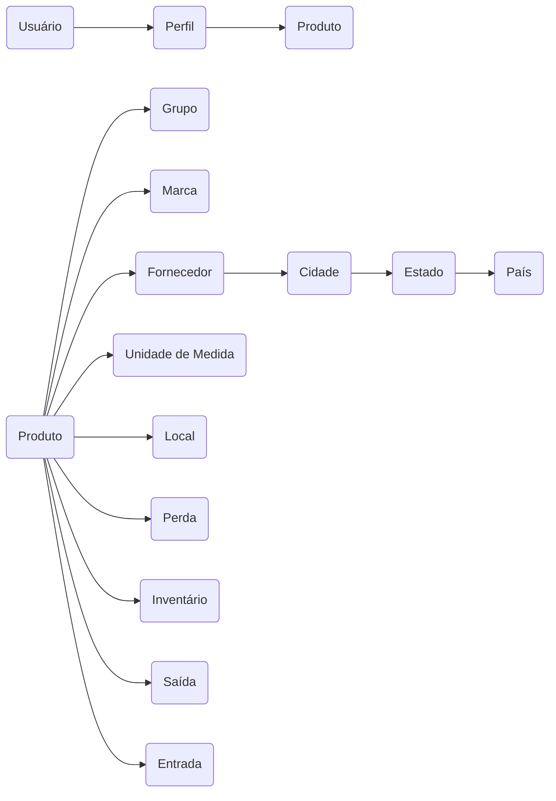

Pré-projeto para a disciplina de Análise e Projeto de Sistemas.

### <!-- Sistema de Gerenciamento de Materiais Ferroviários -  --> SISMF

**GRUPOS DE FUNCIONALIDADES:**

1) **Infraestrutura:**
- Tratamento de Exceção;
- Gravação de Logs em arquivos;	
- Autenticação;
- Autorização;
- Auditoria;

2) **Cadastros:**
- Grupos (tipos) de produtos;
- Marcas de produtos;
- Locais de Armazenamento;
- Unidades de Medida;
- Países, Estados, Cidades;
- Fornecedores;
- Produtos;
- Perfis de Usuários;
- Usuários

3) **Operações:**
- Entrada de Produtos;
- Saída de Produtos;
- Lançamentos de Perdas de Produtos;
- Inventário de Estoque;

4) **Relatórios:**
- Posição de estoque;
- Ressuprimento;

5) **Gráficos:**
- Perdas por mês;
- Entradas vs Saídas por mês;

<!-- ### Apresentação da Aplicação -->


### FLUXO DE EXECUÇÃO BÁSICO:

Usuário está ligado a todas as entidades, que acabam por se tornar tabelas do banco de dados e referência semântica para o padrão de projeto MVC:



### FUNCIONALIDADES DA APP:

**Menu do Sistema:**

Com as entidades definidas já é possível criar as guias de menu com as listas suspensas (Dropdowns) de funcionalidades, aplicando a abordagem Top Down para abstrair os respectivos Controllers e Métodos. Vide abaixo trecho de código das listas de menu em   `sismf_web\Views\Shared\_Layout.cshtml`:

```cs
<!DOCTYPE html>
<html>
...
            <div class="navbar-collapse collapse">
                <ul class="nav navbar-nav">
                    @*Guia do dropdown*@
                    <li>
                        <a href="#" class="dropdown-toggle" data-toggle="dropdown">
                            @*Propriedades que mostram o dropdown*@
                            Cadastros
                            <span class="caret"></span>
                        </a>
                        <ul class="dropdown-menu">
                            <li>@Html.ActionLink("Grupo de Produtos", "GrupoProduto", "Cadastro")</li>
                            <li>@Html.ActionLink("Marcas de Produtos", "MarcaProduto", "Cadastro")</li>
                            <li>@Html.ActionLink("Locais de Armazenamento", "LocalProduto", "Cadastro")</li>
                            <li>@Html.ActionLink("Unidades de Medida", "UnidadeMedida", "Cadastro")</li>
                            <li>@Html.ActionLink("Produtos", "Produto", "Cadastro")</li>
                            <li class="nav-divider"></li>
                            <li>@Html.ActionLink("Países", "Pais", "Cadastro")</li>
                            <li>@Html.ActionLink("Estados", "Estado", "Cadastro")</li>
                            <li>@Html.ActionLink("Cidades", "Cidade", "Cadastro")</li>
                            <li class="nav-divider"></li>
                            <li>@Html.ActionLink("Perfis de Usuários", "UsarioPerfil", "Cadastro")</li>
                            <li>@Html.ActionLink("Usuários", "Usuario", "Cadastro")</li>
                        </ul>
                    </li>

                    <li>
                        <a href="#" class="dropdown-toggle" data-toggle="dropdown">
                            Operações
                            <span class="caret"></span>
                        </a>
                        <ul class="dropdown-menu">
                            <li>@Html.ActionLink("Entrada de Produtos", "EntradaProduto", "Operacao")</li>
                            <li>@Html.ActionLink("Saída de Produtos", "SaidaProduto", "Operacao")</li>
                            <li>@Html.ActionLink("Lançamento de Perdas de Produto", "LancPerdaProduto", "Operacao")</li>
                            <li>@Html.ActionLink("Inventário de Estoque", "InvetarioEstoque", "Operacao")</li>
                        </ul>
                    </li>

                    <li>
                        <a href="#" class="dropdown-toggle" data-toggle="dropdown">
                            Relatórios
                            <span class="caret"></span>
                        </a>
                        <ul class="dropdown-menu">
                            <li>@Html.ActionLink("Posição do Estoque", "PosicaoEstoque", "Relatorio")</li>
                            <li>@Html.ActionLink("Ressuprimento", "Ressuprimento", "Relatorio")</li>
                        </ul>
                    </li>

                    <li>
                        <a href="#" class="dropdown-toggle" data-toggle="dropdown">
                            Gráficos
                            <span class="caret"></span>
                        </a>
                        <ul class="dropdown-menu">
                            <li>@Html.ActionLink("Perdas por mês", "PerdaMes", "Grafico")</li>
                            <li>@Html.ActionLink("Entradas vs Saídas por mês", "EntradaSaidaMes", "Grafico")</li>
                        </ul>
                    </li>
                </ul>


                @*Guias simples na mesma lâmina (sem dropdown): <li>@Html.ActionLink("Text", "Action", "Controller")</li> *@
                <ul class="nav navbar-nav navbar-right">
                    <li>@Html.ActionLink("Sobre o SISMF", "About", "Home")</li>
                    <li>@Html.ActionLink("Desenvolvedor", "Contact", "Home")</li>
                </ul>
            </div>
        </div>
    </div>
    <div class="container body-content">
        @RenderBody()
        <hr />
        <footer>
            <p>&copy; @DateTime.Now.Year - Desenvolvido por Yullano Santos</p>
        </footer>
...
</html>

```

**Autenticação**:

Uma view Login precisa ser criada para coletar o input de credenciais do usuário. Sendo assim, o Controller "Conta" chama a Action Login, passa como parâmetro a URL e o método HTTP e mais algumas estilizações da View. Teremos então dois campos (login e senha) + checkbox + submit, e finalizando a faremos Controller que vai suportar as ações dessa View. Vide abaixo:

```cs
<div class="container">
    <div class="row">
        <h3 class="titulo">Login no SISMF</h3>
    </div>
    <div class="row">
        <section id="loginform">
            @using (Html.BeginForm(
                "Login","Conta", new { ReturnUrl = ViewBag.ReturnUrl }, 
                FormMethod.Post, new { @class = "form-horizontal", role = "form" }
                ))
            {
                <div class="form-group">
                    @Html.LabelFor(m => m.Usuario, new { @class = "form-label col-md-2" })
                    <div class="col-md-10">
                        @Html.TextBoxFor(m => m.Usuario, new { @class = "form-control" })
                    </div>
                </div>

                <div class="form-group">
                    <div class="col-md-10 col-md-offset-2">
                        @Html.CheckBoxFor(m => m.LembrarMe)
                        @Html.LabelFor(m => m.LembrarMe)
                    </div>
                </div>

                <div class="form-group">
                    <div class="col-md-10 col-md-offset-2">
                        <input type="submit" class="btn btn-sucess" value="Entrar" />
                    </div>
                </div>
            }
        </section>
    </div>
</div>
```

Em seguida configura-se o ASP NET para trabalhar com forms indo até o `web.config`, ncluindo nele as seções Authorization e Authentication.

```cs

<configuration>
...
  <system.web>
      <authentication mode="Forms">
          <forms loginUrl="~/Conta/Login" name=".sismf_web"></forms>
      </authentication>
      <authorization >
          <deny users="?"/>
      </authorization>
    <compilation debug="true" targetFramework="4.5.2" />
    <httpRuntime targetFramework="4.5.2" />
    ...
  </system.web>

```

Em seguida, fazemos a ligação através da respectiva ViewModel, e criada a classe, incluimos os nossos atributos.
Um recurso bacana para melhorar os labels no front, é usar o atributo [Display(Name "Texto")].

```cs
namespace sismf_web.Models
{
    public class LoginViewModel
    {
        [Display(Name = "Usuário: ")]
        public string Usuario { get; set;  }

        [Display(Name = "Senha: ")]
        public string Senha { get; set; }

        [Display(Name = "Lembrar meus dados")]
        public bool LembrarMe { get; set; }
    }
}
```

Após, fazemos um bind na View `Login`, e assim ela saberá quem é o sua Model correpondente:

```cs
@model sismf_web.Models.LoginViewModel

@{ ViewBag.Title = "Login";}
```

Finalizando, criamos o método HTTP, decorando com `HttpPost` que possui os parâmetros Login e a URL:

```cs
        [HttpPost]
        [AllowAnonymous]
        public ActionResult Login(LoginViewModel login, string returnUrl)
        {
            if (!ModelState.IsValid)
            {
                return View(login);
            }
            return View(login);
        }
    }
}
```


<!-- 

### Modelo de Dados


### Tecnologias Utilizadas

- .NET Framework 4.5.2
- C#
- ASP.NET MVC 5
- Xamarin
- Entity Framework
- SQL Server Express
- Log4net
- Javascript(jQuery)
- AJAX
- Bootstrap
- IIS
- Crystal Reports
- Google Graphs

### Estrutura Básica da App


### Controle de Usuários


### Cadastros


### Relatórios


### Gráficos


### Aplicativo Móvel

### SmartyPants

|                |ASCII                          |HTML                         |
|----------------|-------------------------------|-----------------------------|
|Single backticks|`'Isn't this fun?'`            |'Isn't this fun?'            |
|Quotes          |`"Isn't this fun?"`            |"Isn't this fun?"            |
|Dashes          |`-- is en-dash, --- is em-dash`|-- is en-dash, --- is em-dash|
 -->


<!-- Tools:
#mermaid
#stackedit

### Conceitos Básicos
Controle de fluxo de entrada e saída de produtos em uma empresa.
- Conjunto de produtos armazenados em um local.
- Dinheiro armazenado na empresa;
- 
**Pra que serve?**
- Bater as contas no final do mês;
- Calcular Lucros;
- Identificar perdas;
- Contribuir para o governo(ICMS);
---
Tipos de Estoque:
- **Matéria-prima** (celulose, minério de ferro, petróleo, etc).
- **Produtos não acabados** (peças, motores, chips, componentes eletrônicos, etc).
- **Produtos finalizados**  (carros, notebooks, etc).
- **Consumíveis** - (combustíveis, materiais de escritório, etc). 


### Drafts:

Tudo começa na compra, todo produto é comprado por um fornecedor.
E aí há uma entrada, uma saída e a venda pelo PDV.

Em algum momento as perdas precisam ser registradas.
Inventário também tem que ser feito de tempos em tempos.

Cuidados:

1. Nunca pode faltar produto (relatórios fazem a diferença);
2. Nunca pode sobrar produtos em exagero;
3. Fazer inventários periodicamente;
4. Controlar a quantidade mínima (para não deixar faltar);


BundleConfig - minificação de recursos (javascript, css e etc);
FilterConfig - Filtros Aspnet;
RouteConfig - Rota padrão;

Controller - Default é o home e é o ponto de entrada de cada uma das rotas;

Todas as páginas por padrão herdam de Shared;

Template ASP net MVC.


Após a definição do Dropdown, criamos respectivos Controllers e Views.

Os mecanismos de autenticação são dividos em 4 grandes categorias:

- Senhas que o usuário tem que lembrar;
- Cartão de banco, Token de acesso, código SMS;
- Impressão digital, Análise de retina, reconhecimento de voz ou facial;
- Localização do usuário (Endereço de Adaptador de Rede, GPS);


-->