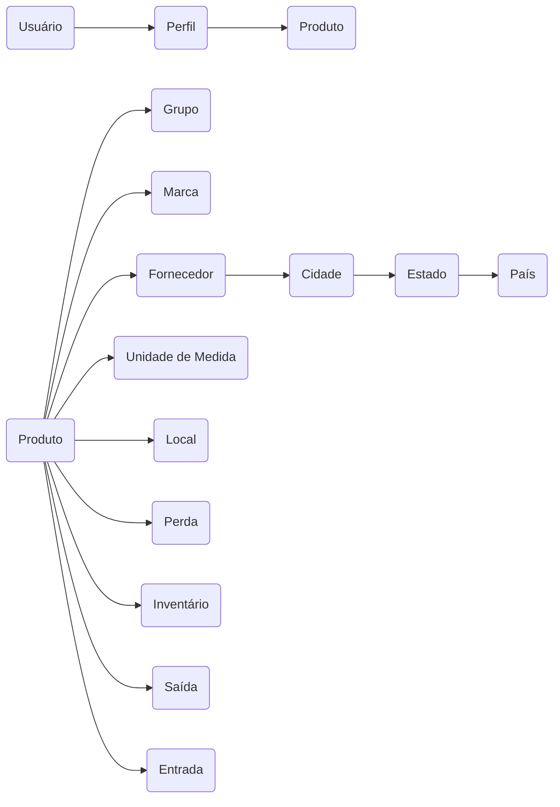

### <!-- Sistema de Gestão de Materiais Ferroviários -  --> SISMF

### Conceitos Básicos
Controle de fluxo de entrada e saída de produtos em uma empresa.
- Conjunto de produtos armazenados em um local.
- Dinheiro armazenado na empresa;
- 
**Pra que serve?**
- Bater as contas no final do mês;
- Calcular Lucros;
- Identificar perdas;
- Contribuir para o governo(ICMS);
---
Tipos de Estoque:
- **Matéria-prima** (celulose, minério de ferro, petróleo, etc).
- **Produtos não acabados** (peças, motores, chips, componentes eletrônicos, etc).
- **Produtos finalizados**  (carros, notebooks, etc).
- **Consumíveis** - (combustíveis, materiais de escritório, etc).

Grupos de Funcionalidades:
1) **Infraestrutura:**
	Tratamento de Exceção;
	Gravação de Logs em arquivos;	
	Autenticação;
	Autorização;
	Auditoria;

2) **Cadastros:**
	Grupos (tipos) de produtos;
	Marcas de produtos;
	Locais de Armazenamento;
	Unidades de Medida;
	Países, Estados, Cidades;
	Fornecedores;
	Produtos;
	Perfis de Usuários;
	Usuários

3) **Operações:**
	Entrada de Produtos;
	Saída de Produtos;
	Lançamentos de Perdas de Produtos;
	Inventário de Estoque;

4) **Relatórios:**
	Posição de estoque;
	Ressuprimento;

5) **Gráficos:**
	Perdas por mês;
	Entradas vs Saídas por mês;

### Apresentação da Aplicação

Usuário está ligado a todas as entidades, que em breve serão tabelas do nosso banco de dados:

### Fluxo de Execução Típico

### Funcionalidades da App

### Modelo de Dados

### Tecnologias Utilizadas

- .NET Framework 4.5.2
- C#
- ASP.NET MVC 5
- Xamarin
- Entity Framework
- SQL Server Express
- Log4net
- Javascript(jQuery)
- AJAX
- Bootstrap
- IIS
- Crystal Reports
- Google Graphs

### Estrutura Básica da App

### Controle de Usuários

### Cadastros

### Relatórios

### Gráficos

### Aplicativo Móvel

### SmartyPants

|                |ASCII                          |HTML                         |
|----------------|-------------------------------|-----------------------------|
|Single backticks|`'Isn't this fun?'`            |'Isn't this fun?'            |
|Quotes          |`"Isn't this fun?"`            |"Isn't this fun?"            |
|Dashes          |`-- is en-dash, --- is em-dash`|-- is en-dash, --- is em-dash|

### Final Drafts:

Tudo começa na compra, todo produto é comprado por um fornecedor.
E aí há uma entrada, uma saída e a venda pelo PDV.

Em algum momento as perdas precisam ser registradas.
Inventário também tem que ser feito de tempos em tempos.

Cuidados:

1. Nunca pode faltar produto (relatórios fazem a diferença);
2. Nunca pode sobrar produtos em exagero;
3. Fazer inventários periodicamente;
4. Controlar a quantidade mínima (para não deixar faltar);

BundleConfig - minificação de recursos;
FilterConfig - Filtros Aspnet;
RouteConfig - Rota padrão;

Controller - Default é o home e é o ponto de entrada de cada uma das rotas;

Todas as páginas por padrão herdam se Shared;

Tools:
#mermaid
#stackedit